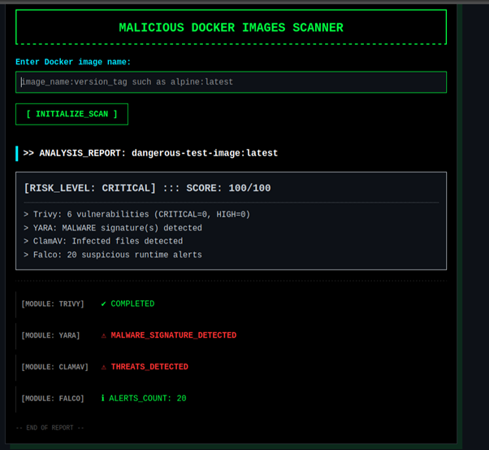
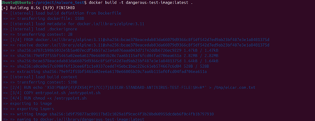

# 🛡️ Hybrid Framework for Detecting Vulnerable and Malicious Docker Images

## 🧐 Overview
Think of this tool as a **forensic scanner for Docker images**.

Most standard security tools (like Trivy) only look at the "packing list" (metadata) to identify old software versions. They do not actually open the "suitcase" to see what is inside.

**This project changes that.** It creates a hybrid scanning pipeline that:
1.  **Extracts** the file system from a Docker image.
2.  **Scans** for hidden malware, viruses, and secrets (Static Analysis).
3.  **Executes** the container in a sandbox to watch for suspicious behavior (Dynamic Analysis).
4.  **Aggregates** all findings into a single **Risk Score (0-100)**.

## 📸 Examples of GUI:
| **Critical Risk Alert (Web UI)** | **Build Process (Terminal)** |
|:---:|:---:|
|  |  |

---

## 🚀 Key Features

* **Multi-Scanner Integration:**
    * **Trivy:** Detects OS and package vulnerabilities (CVEs).
    * **YARA:** Scans files for custom malware patterns (e.g., specific strings).
    * **ClamAV:** Scans for known virus signatures.
    * **Falco:** Monitors runtime system calls (e.g., unexpected shell usage).
* **Smart Risk Scoring:**
    * Calculates a normalized score (0-100).
    * **Critical Risk (100):** If *any* malware signature is found.
    * **High/Medium Risk:** Based on the severity of CVEs and runtime alerts.
* **Web Dashboard:**
    * Simple UI to input `image_name:version_tag`.
    * Real-time scanning status.
    * "Pass/Block" decision based on the final score.

---

## ⚙️ System Architecture

The scanner operates in a 4-step hybrid pipeline.

```mermaid
graph TD
    User[User Input] -->|Image Name| API[Backend Engine]
    API --->|Step 1: Save & Extract| Static[Static Analysis]
    API --->|Step 2: Run & Monitor| Dynamic[Dynamic Analysis]
    
    subgraph "Static Scanners"
        Static --> Trivy
        Static --> YARA
        Static --> ClamAV
    end
    
    subgraph "Dynamic Scanners"
        Dynamic --> Falco
    end
    
    Trivy --> Aggregator[Risk Aggregator]
    YARA --> Aggregator
    ClamAV --> Aggregator
    Falco --> Aggregator
    
    Aggregator -->|Score & Alerts| Report[Analysis Report(Web Report)]
```
## 💻 Installation & Setup
**Recommended Environment:**
Ubuntu 20.04/22.04 LTS (Virtual Machine or Native).\
Note: This project relies on Linux-specific tools (Falco, ClamAV) and is optimized for Linux environments.
### 1. System Prerequisites
Run the following commands in your Ubuntu terminal to install the necessary engines:
```bash
# Update repositories
sudo apt-get update

# Install ClamAV & YARA (Antivirus & Pattern Matching)
#libyara-dev' is required for the Python YARA library to work correctly
sudo apt-get install clamav clamav-daemon yara libyara-dev -y

# Install Trivy (Vulnerability Scanner)
#Trivy is not in default repos, so we install it manually:` 
sudo apt-get install wget apt-transport-https gnupg lsb-release -y
wget -qO - [https://aquasecurity.github.io/trivy-repo/deb/public.key](https://aquasecurity.github.io/trivy-repo/deb/public.key) | sudo apt-key add -
echo deb [https://aquasecurity.github.io/trivy-repo/deb](https://aquasecurity.github.io/trivy-repo/deb) $(lsb_release -sc) main | sudo tee -a /etc/apt/sources.list.d/trivy.list
sudo apt-get update
sudo apt-get install trivy

# Ensure Docker is installed and running
sudo systemctl start docker
sudo usermod -aG docker $USER
```
(Note: Falco must be installed separately following the official Falco docs).

### 2. Clone & Install Project
```bash
git clone [https://github.com/AmritaCSN/malicious-docker-images-scanner.git](https://github.com/AmritaCSN/malicious-docker-images-scanner.git)
cd malicious-docker-images-scanner
```
```bash
# Create and Activate Virtual Environment
python3 -m venv venv
source venv/bin/activate
```
```bash
# Install Python dependencies
pip3 install -r requirements.txt
```
### 3. Run the Scanner
```bash
python3 run.py
```
The application will start on http://localhost:5000.

## 🕵️ Usage Guide

### 1. Scanning Standard Images (Docker Hub)
The scanner can analyze **any** Docker image present on your system (pulled from Docker Hub or built locally).

**Example: Scanning the official Nginx image**
1.  Pull the image first:
    ```bash
    docker pull nginx:latest
    ```
2.  Go to the Web Dashboard (`http://localhost:5000`).
3.  Enter the image name:
    ```text
    nginx:latest
    ```
4.  Click **Initialize Scan**. The tool will extract the file system and run all checks (Trivy, YARA, ClamAV, Falco).

### 2. Scanning Custom/Local Images
You can also scan images you have built yourself. Just ensure the image exists in your local registry by running `docker images`.

---

## 🧪 How to Test (Proof of Concept)
To prove the efficacy of the scanner, we have created custom "Dangerous" images that mimic real-world threats.

1. Build the Malware Test Image (Signature-based) This image contains the EICAR test string, which triggers YARA/ClamAV.
```bash
# Run inside /malware_test folder
docker build -f Dockerfile.signature -t dangerous-test-image:latest .
```
2. Build the Behavior Test Image (Runtime-based) This image runs a script mimicking a crypto-miner, which triggers Falco.

```bash
# Run inside /malware_test folder
docker build -f Dockerfile.behavior -t dangerous-behavior:latest .
```
3. Scan them!
* Go to http://localhost:5000.
* Scan dangerous-test-image:latest $\rightarrow$ Result: CRITICAL (Score: 100).
* Scan dangerous-behavior:latest $\rightarrow$ Result: HIGH RISK.
* Scan other images as well by following the same steps such as by entering the image name and the respective tag version.

## 📁 Project Structure
* app/: Flask web server and UI templates.
* static_scan/: Scripts for Trivy, YARA, and ClamAV logic.
* dynamic_scan/: Scripts for running the container and parsing Falco logs.
* ml_model/: Logic for Risk Score calculation.
* malware_test/: Dockerfiles for creating test data.

## References

* **Conference Papers**

1. Rui Shu, Xiaohui Gu, and William Enck. "A Study of Security Vulnerabilities on Docker Hub," Proceedings of the Seventh ACM Conference on Data and Application Security and Privacy (CODASPY '17). ACM, New York, NY, USA, 2017, pp. 269–280.

2. Mubin Ul Haque and M. Ali Babar. "Well Begun is Half Done: An Empirical Study of Exploitability & Impact of Base-Image Vulnerabilities," 2022 IEEE International Conference on Software Analysis, Evolution and Reengineering (SANER), 2022.

3. Ruchika Malhotra, Anjali Bansal, and Marouane Kessentini. "Vulnerability Analysis of Docker Hub Official Images and Verified Images," 2023 IEEE International Conference on Service-Oriented System Engineering (SOSE), Athens, Greece, 2023, pp. 150-155.

4. Vivek Saxena, Deepika Saxena, and Uday Pratap Singh. "Security Enhancement using Image verification method to Secure Docker Containers," Proceedings of the 4th International Conference on Information Management & Machine Intelligence (ICIMMI '22). ACM, New York, NY, USA, 2023, Article 42, pp. 1–5.

* **Journal Articles & Surveys** 

5. Devi Priya V S, Sibi Chakkaravarthy Sethuraman, and Muhammad Khurram Khan. "Container security: Precaution levels, mitigation strategies, and research perspectives," Computers & Security, Volume 135, 2023.
6. Omar Jarkas, Ryan Ko, Naipeng Dong, and Redowan Mahmud. "A Container Security Survey: Exploits, Attacks, and Defenses," ACM Computing Surveys, Vol. 57, No. 7, Article 170, July 2025.
7. Juan M. Corchado, Byung-Gyu Kim, Carlos A. Iglesias, In Lee, Fuji Ren, and Rashid Mehmood. "Experimental Analysis of Security Attacks for Docker Container Communications," Electronics (MDPI), 2023, 12(4):940.
8. Rui Queiroz, Tiago Cruz, Jérôme Mendes, Pedro Sousa, and Paulo Simões. "Container-based Virtualization for Real-time Industrial Systems—A Systematic Review," ACM Computing Surveys, 2023.
9. Ajith, V., Cyriac, T., Chavda, C., Kiyani, A. T., Chennareddy, V., & Ali, K. "Analyzing Docker Vulnerabilities through Static and Dynamic Methods and Enhancing IoT Security with AWS IoT Core, CloudWatch, and GuardDuty," Preprints, 2024.

* **Online Resources & Tools**

10. Docker Security Documentation: https://docs.docker.com/engine/security/ 
11. Tigera.io: "Container Vulnerability Scanning: Importance & 10 Best Practices." 
12. GitGuardian: "Container Security Scanning: Vulnerabilities, Risks, and Tooling," GitGuardian Blog. 
13. CrowdStrike: "Container Security Explained," CrowdStrike Cybersecurity 101. 
14. GitHub - anchore/grype: A vulnerability scanner for container images and filesystems. 
15. GitHub - anchore/syft: CLI tool and library for generating a Software Bill of Materials from container images.
16. ClamAV: Open-Source Antivirus Software Toolkit for UNIX (Cisco Talos Intelligence Group).

## 🔧 Troubleshooting

* **Error: `docker: permission denied`**
    * **Fix:** Run `sudo usermod -aG docker $USER` and restart your VM (or log out/in).
* **Error: `Falco: kernel module not found`**
    * **Fix:** Ensure you are running on a Linux host/VM. Falco does not support standard Windows/WSL2 kernels natively without specific tuning.
* **Scanner hangs on "Pulling image..."**
    * **Fix:** Check your internet connection. Docker Hub requires a stable network to download new layers.
